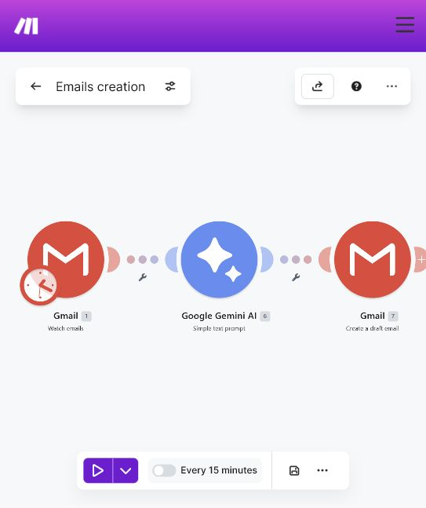
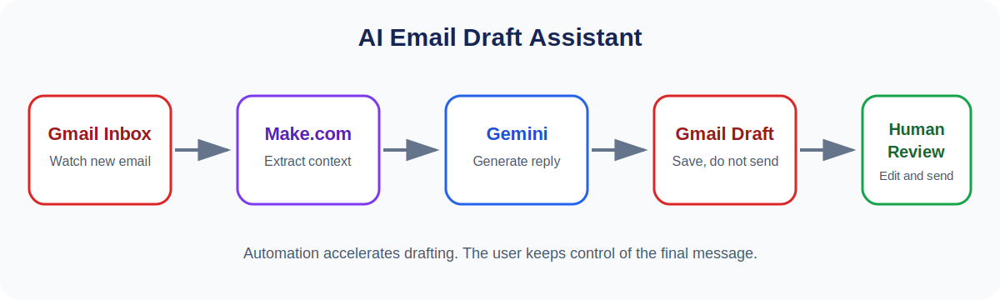
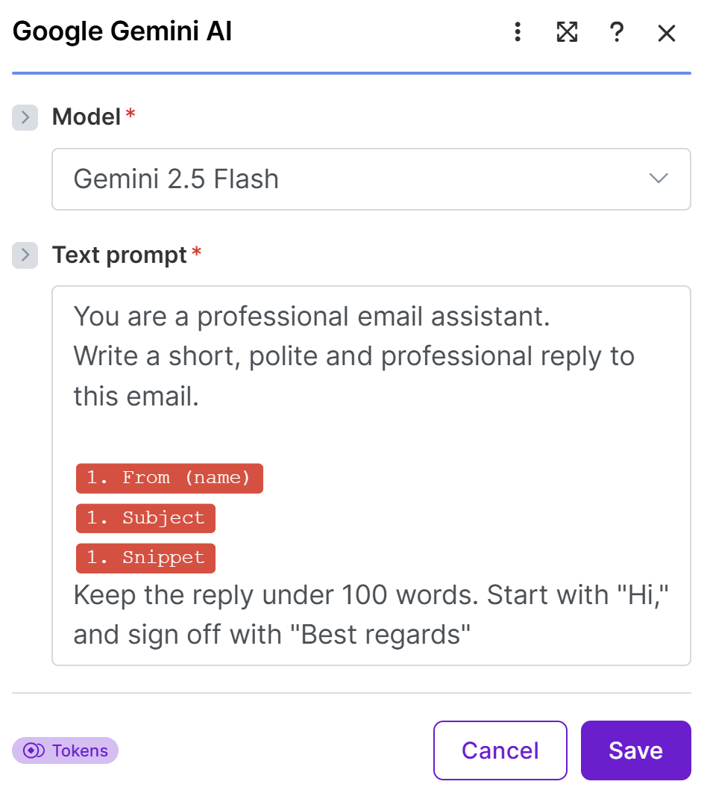

# AI Email Draft Assistant

A human-in-the-loop email automation that monitors a Gmail inbox, asks Google Gemini to write a concise professional reply, and saves the result as a Gmail draft. The owner reviews and edits the draft before sending it.

## Problem

Writing routine replies takes time, but fully automatic sending can create communication and accuracy risks. This workflow speeds up drafting while keeping the final decision with the user.

## Workflow

1. Gmail is checked for a new message every 15 minutes.
2. Make.com extracts the sender name, sender address, subject, and message snippet.
3. Gemini 2.5 Flash receives a prompt requesting a short, polite, professional reply.
4. Make.com creates a Gmail draft addressed to the original sender.
5. The user reviews, edits, and manually sends the reply.

## Tools

- Make.com for workflow orchestration
- Gmail for inbox monitoring and draft creation
- Google Gemini 2.5 Flash for reply generation

## Business Value

- Reduces repetitive email drafting work
- Helps maintain a concise and professional tone
- Keeps human review before any message is sent
- Can be adapted for support, sales, recruiting, or general business inquiries

## Gemini Configuration

The prompt uses the incoming sender name, subject, and message snippet. It requests a reply under 100 words, beginning with `Hi,` and ending with `Best regards`.

## Import the Blueprint

1. Download [`ai-email-draft-assistant.json`](blueprint/ai-email-draft-assistant.json).
2. Open a new or existing scenario in Make.com.
3. Open the scenario menu and choose **Import blueprint**.
4. Select the downloaded JSON file.
5. Configure your own Gmail and Gemini connections.
6. Review the prompt, schedule, and draft fields before activating the scenario.

## Privacy and Safety

- The published blueprint contains no API keys, passwords, connection IDs, or personal email addresses.
- The scenario creates drafts only; it does not automatically send email.
- Review generated replies for correctness, tone, and sensitive information before sending.

## Possible Improvements

- Filter newsletters and automated notifications
- Add different reply styles based on message category
- Include calendar availability for meeting requests
- Log reviewed drafts and response times in a spreadsheet or CRM

