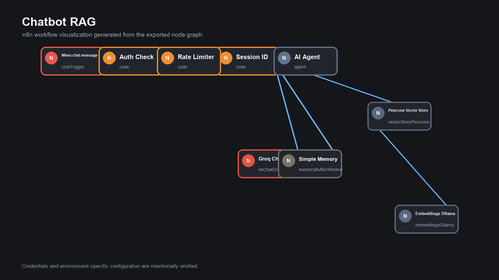
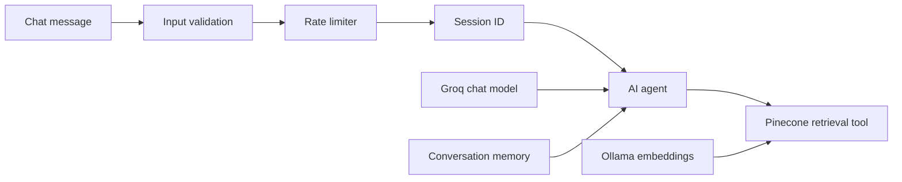

# RAG Customer Support Chatbot

An n8n retrieval-augmented generation chatbot that answers ecommerce support questions from indexed documentation instead of relying on unrestricted model knowledge.

> Status: portfolio prototype. Production execution metrics are not claimed.

## Workflow

1. Receive a chat message.
2. Reject empty requests.
3. Enforce a per-session hourly rate limit.
4. Create or reuse a session identifier.
5. Retrieve relevant documentation from Pinecone.
6. Generate a grounded response with a Groq-hosted model.
7. Preserve short conversation context with n8n memory.

## Architecture

## Tools

- n8n
- Groq chat model
- Pinecone vector database
- Ollama `nomic-embed-text` embeddings

## Import

Import `workflow/chatbot-rag.json`, then configure Groq, Pinecone, and Ollama credentials or endpoints. Verify the index name and test the request validation and rate-limit behavior before publishing the chat trigger.

## Security

The export contains no credentials. The current authentication node validates message presence rather than user identity, so production deployment should add real authentication at the application or gateway layer.

