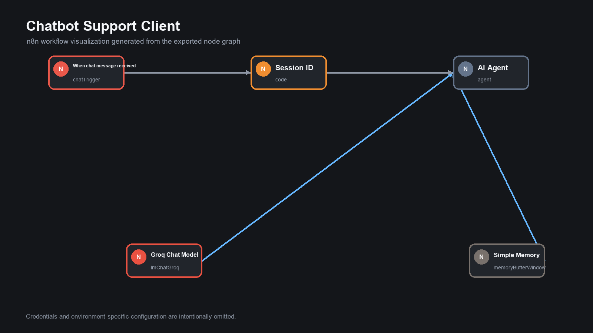
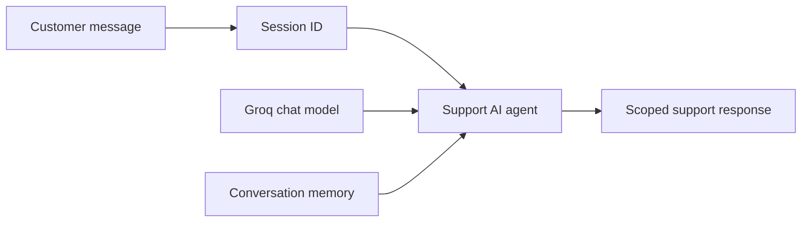

# Customer Support Chatbot

An n8n conversational support assistant for common ecommerce questions about products, delivery, orders, returns, and refunds.

> Status: portfolio prototype. Production execution metrics are not claimed.

## Workflow

1. Receive a customer chat message.
2. Create or reuse a session identifier.
3. Send the message to a scoped AI support agent.
4. Use a Groq-hosted model to generate the response.
5. Preserve short conversation context with n8n memory.

## Architecture

## Guardrails

- Does not process payment information
- Does not access customer accounts
- Does not modify orders
- Escalates complex cases to human support
- Stays within the defined support domain

## Import

Import `workflow/customer-support-chatbot.json`, configure Groq credentials, replace the sample support policy with approved business information, and add authentication before exposing the chat publicly.

## Security

Credentials and sample contact details are removed. The embedded knowledge is illustrative and should be replaced with verified company policy before deployment.

