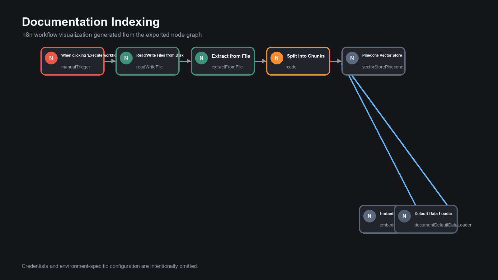
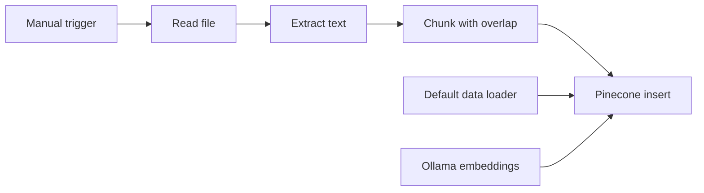

# Documentation Indexing Pipeline

An n8n ingestion workflow that reads a document, extracts its text, splits it into overlapping chunks, creates embeddings, and inserts the content into Pinecone for semantic retrieval.

> Status: portfolio prototype. Production execution metrics are not claimed.

## Workflow

1. Start the pipeline manually.
2. Read a document from disk.
3. Extract plain text.
4. Split content into 1,000-character chunks with 200-character overlap.
5. Add source and chunk-index metadata.
6. Generate embeddings with Ollama.
7. Insert the documents into a Pinecone index.

## Architecture

## Relationship to the RAG Chatbot

This pipeline prepares the knowledge base consumed by the RAG Customer Support Chatbot. The two projects demonstrate the ingestion and retrieval sides of a complete RAG system.

## Import

Import `workflow/documentation-indexing.json`, configure the document path, Ollama endpoint, Pinecone credentials, and target index, then test with non-sensitive sample documentation.

## Security

The local source path and credentials are removed. Do not index confidential documents without appropriate access controls, retention policies, and deletion procedures.

