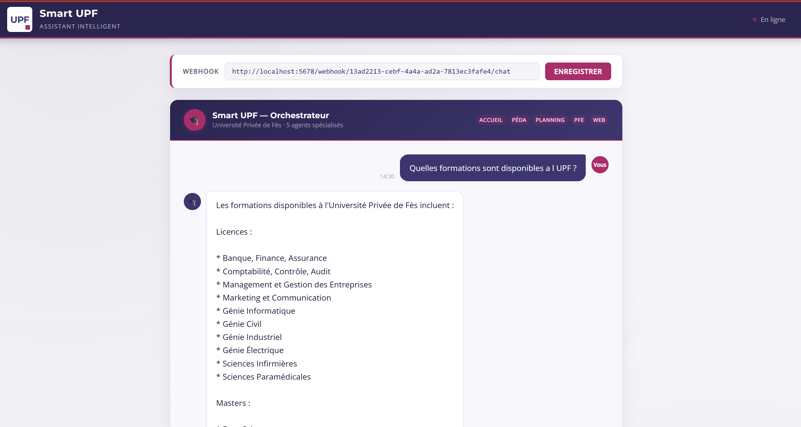
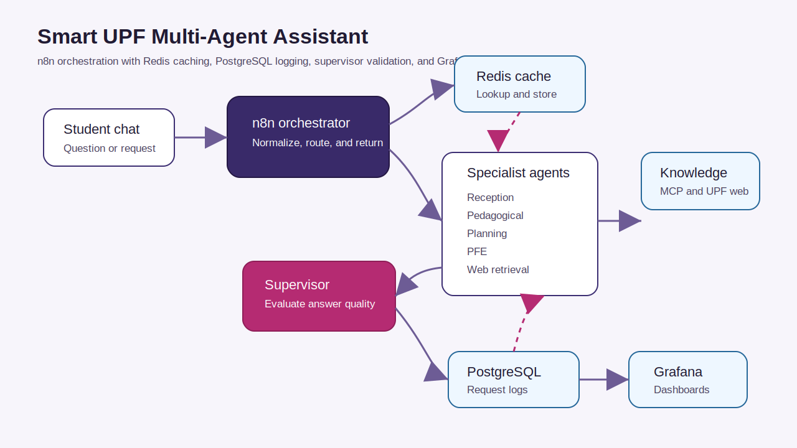
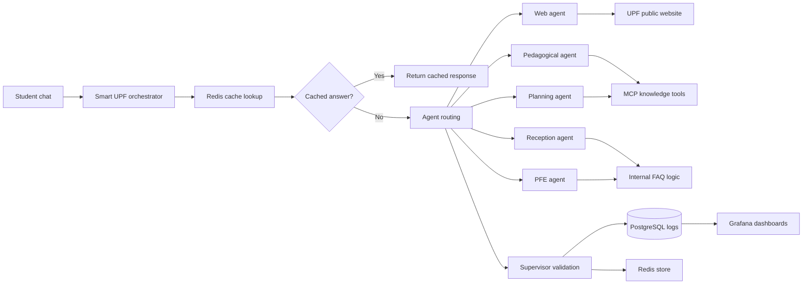

# Smart UPF Multi-Agent Assistant

An n8n-based multi-agent chatbot for university services, with Redis caching, PostgreSQL logging, supervisor validation, and Grafana observability.

> Status: portfolio prototype. Production execution metrics are not claimed.

## Problem Solved

University students often ask questions across many domains: admissions, programs, schedules, exams, final-year projects, and general services. A single assistant prompt becomes hard to maintain when every topic, data source, and response rule is mixed together.

Smart UPF separates the assistant into specialized workflows. The orchestrator receives each question, checks the cache, delegates the request to the right agent, validates the answer, stores useful responses, and logs events for monitoring.

## Architecture

## Trigger

- n8n chat/webhook trigger receives the student question.
- The request is normalized and logged.
- Redis is checked before running the full agent workflow.

## Workflow Steps

1. Prepare request context from the incoming chat message.
2. Look up a cached answer in Redis.
3. Return the cached answer immediately when available.
4. Route uncached questions through the Smart UPF orchestrator agent.
5. Delegate to one of five specialist workflows: reception, pedagogical, planning, PFE, or web.
6. Validate the generated answer with a supervisor workflow.
7. Store successful answers in Redis for faster future replies.
8. Update PostgreSQL request logs with completed or failed status.
9. Monitor request volume, response categories, and agent usage in Grafana.

## Tools Integrated

- n8n workflow automation
- Ollama chat models
- MCP tools for knowledge access
- Redis for response caching
- PostgreSQL for logs and request history
- HTTP request nodes for UPF public website retrieval
- Grafana dashboards for observability
- JavaScript code nodes for formatting, validation, and routing helpers

## Business Value

- Faster answers through caching.
- Cleaner maintenance through specialist workflows.
- Better reliability through supervisor validation and failure handling.
- More visibility through structured PostgreSQL logs and Grafana dashboards.
- Easier future expansion: new university services can be added as new specialist agents.

## Workflow Files

The `workflow/` folder contains sanitized n8n exports:

- `smart-upf-orchestrator-workflow.json`
- `supervisor-agent-workflow.json`
- `reception-agent-workflow.json`
- `pedagogical-agent-workflow.json`
- `planning-agent-workflow.json`
- `pfe-agent-workflow.json`
- `web-agent-workflow.json`
- `utility-log-event-workflow.json`
- `utility-error-handler-workflow.json`

After importing into n8n, configure your own Redis, PostgreSQL, Ollama, MCP, and workflow references.

## Screenshots

- Chat UI: `screenshots/smart-upf-chat-interface.png`
- Grafana KPIs: `screenshots/grafana-kpi-dashboard.png`
- Grafana agent performance: `screenshots/grafana-agent-performance-dashboard.png`
- Orchestrator workflow: `screenshots/orchestrator-workflow-full-canvas.png`
- Supervisor workflow: `screenshots/supervisor-agent-workflow.png`
- Specialist and utility workflows are also included in `screenshots/`.

## Security

- Published workflow exports are sanitized.
- Credential blocks, instance IDs, webhook IDs, static data, pinned data, and version IDs are removed.
- Workflows are exported as inactive by default.
- Screenshots are included for portfolio review; configure your own environment before reuse.
