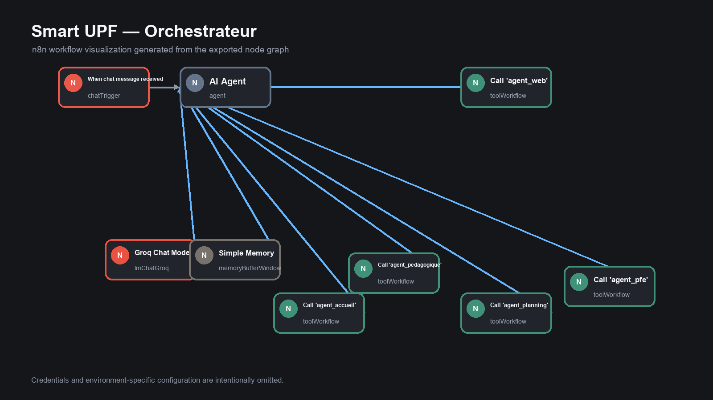
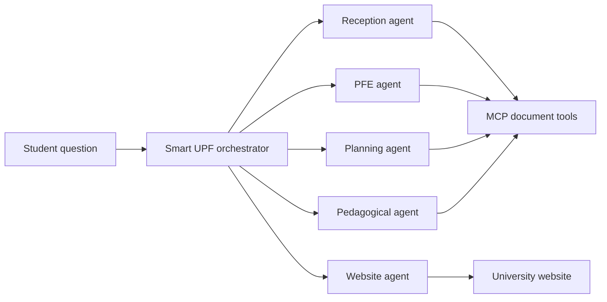

# Smart UPF Multi-Agent System

An n8n multi-agent assistant that routes university questions to five specialist workflows. The orchestrator classifies each request and delegates it to the academic, planning, reception, final-project, or website agent.

> Status: portfolio prototype. Production execution metrics are not claimed.

## Architecture

## Specialist Agents

- **Reception:** general information, registration, contacts, and regulations
- **Website:** programs, admissions, fees, and public website information
- **PFE:** final-project guidance, deadlines, reports, evaluation, and supervision
- **Planning:** schedules, rooms, exams, defenses, and academic events
- **Pedagogical:** SQL, databases, algorithms, exercises, and technical explanations

All agents use Groq-hosted language models and short conversation memory. Four specialists access local knowledge through an MCP server; the website agent retrieves and cleans public website content.

## Workflow Files

The `workflow/` folder contains the sanitized orchestrator and all five agent exports. After importing, configure credentials, the MCP endpoint, document paths, website URL, and workflow references.

## Security

- Credentials and instance-specific IDs are removed.
- Local filesystem paths and contact details are replaced with placeholders.
- Imported workflows are inactive by default.
- Review institutional content and permissions before deployment.

## Screenshots

Additional generated workflow views are available in `screenshots/` for every specialist agent.

